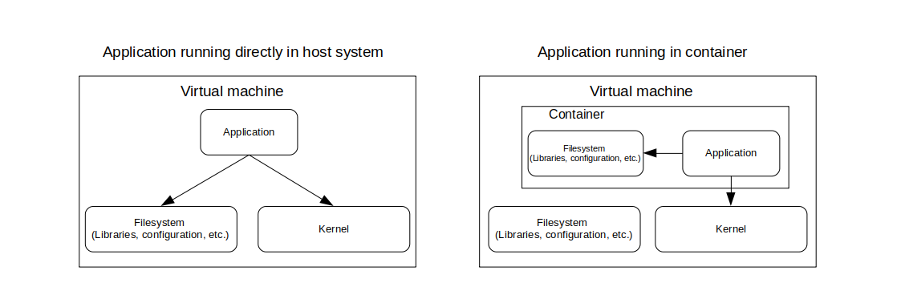

# Origins of containerization

Docker itself is incredibly "young," as it was first launched to the open source development community in 2013. However, containers pre-date Docker as a norm for isolating environments in Linux. 

While Docker built upon the pre-established Linux concepts surrounding containers and virtualization, the platform's persistent centralization of related tooling began to deeply impact technology deployment norms. 

Now, instead of learning all the low-level minutia of customizing containers in Linux, developers just needed to get Docker running, and they could create Docker containers from a number of different interfaces.
 

## Virtualization concepts

This section will introduce a few concepts and terms for you to be aware of before we dive into the specifics of Docker. 

[Virtualization](https://en.wikipedia.org/wiki/Virtualization) itself refers to anytime you create a purely virtual version of something.

#### Virtual machines (VMs)

[Virtual Machines (VMs)](https://en.wikipedia.org/wiki/Virtual_machine) are purely virtual instances of computers which run *on* another, **real**, computer. Virtual machines were first developed in the 1960s, to enable "time sharing" of computing hardware resources for multiple simultaneous users.

The real computer which the VM is running on is often called the 'host,' and the software running on it which creates virtual machines is called a [hypervisor](https://en.wikipedia.org/wiki/Hypervisor).

#### Containers

Whereas a VM gives us virtualization all the way down to the kernel and hardware layers, a [container](https://en.wikipedia.org/wiki/OS-level_virtualization) is much more lightweight in comparison. 

Often called "OS-level virtualization," containers sit on top of the host computer's kernel and merely virtualize from the level of binaries and libraries up to the user interface. 

#### Comparing VMs and Containers

Virtual machines virtualize the entire "tech stack" of a computer down to the hardware. They're a lot more resource-intensive than containers but can be necessary for certain computing tasks. 

Diagram by Chelsea Palmer, [CC BY-SA 4.0](https://creativecommons.org/licenses/by-sa/4.0/)

Some of the benefits of containers over VMs: containers are more **lightweight** on computing resources, more **portable** between environments, and have **lower management overhead** as they run over top of the existing operating system.

On the negative side, containers are slightly **less fault tolerant** than virtual machines in some computing use cases, provide slightly **less security via isolation**, and are obviously not the right choice in instances where special OS or hardware configurations need to be specified.

Another way to model containers vs. VMs, retrieved from [Natlibfi-arlehiko on Wikimedia Commons](https://commons.wikimedia.org/wiki/File:Containers.png), [CC BY-SA 4.0](https://creativecommons.org/licenses/by-sa/4.0/)

#### Docker objects

A Docker **container** is an instance of a Docker **image**. You can run multiple containers, all as instances of the same image. 

The image's specifications provide the information needed to spawn its resulting containers, including their design, content, and constraints. If you need more detail on this, check out [Docker's documentation on Objects](https://docs.docker.com/get-started/overview/#docker-objects).
 

## Virtualization in computing

Across both virtual machines and containers, a few broader principles apply: 

1. The importance of **resource allocation** - how do we ensure computing processes have access to the resources they need?

2. The problem of **isolation** - how do we protect our computing environments from security risks when introducing new computer processes, as well as protecting them from the negative impact of bugs?

3. The strategy of **layering** which we see in action in the first "VMs versus Containers" diagram above: permissions are restricted to lower-level systems layers, preventing containerized processes from touching the operating system.