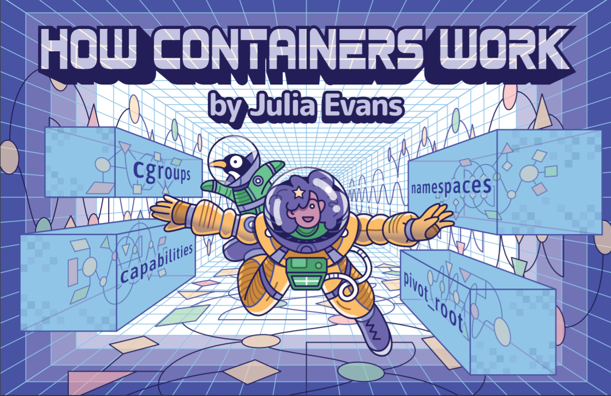

# Resources 

Below you'll find broad categories anchoring further learning resources which are focused on Docker in general, reproducible computing for academia and data science, Docker security, and a stronger computer science/software development focus.

There are also [curated learning resources](https://docs.docker.com/get-started/resources/) within the Docker docs themselves, including tutorials, books, and online courses.

## General Docker Resources

### Videos

[Michele Finelli’s talk on the history of containers and VMS](https://vimeo.com/166626311) - *25 minute overview shedding more light on the history leading to present day Docker*

### Learning Activities

This 30-minute [Docker for Beginners](https://training.play-with-docker.com/beginner-linux/) lab takes place entirely within the browser, and assumes no special knowledge of Docker. It's a great opportunity to test your command line skills in advance of diving deeper.

Once you've got Docker installed on your operating system, [this Docker Labs beginner's tutorial](https://github.com/docker/labs/blob/master/beginner/readme.md) is a great way to dive deeper into hands-on Docker mastery.

### Documentation

If you'd like to get a better overview on containers in general, check out the ["How Containers Work" zine](https://wizardzines.com/zines/containers/) produced by the awesome [Julia Evans, aka b0rk](https://jvns.ca/)
 

Additionally, [this click-through presentation on Docker](https://oer.gitlab.io/oer-on-oer-infrastructure/Docker.html#/slide-org562bf2f) is targeted to those with an interest in Open Educational Resources (OER).

Finally, [this blog post](https://thekrishna.in/blogs/blog/fav-docker-images/) walks through 10 concrete use cases for Docker, linking out to relevant apps and images.

## Reproducible Computing in Academia

### Videos

[This ‘setting the scene’ conference talk](https://vimeo.com/366209343) - *26 min pragmatically covering the various tools, components, and best practices for reproducible research workflows*

[Responding to reproducibility challenges from physics to social sciences](https://vimeo.com/366217811) - *44 min talk on the unique challenges across academic disciplines for reproducible research*

[Building reproducible workflows for earth sciences: The role of containers in reproducible workflows](https://vimeo.com/366733341) - *23 min deep dive on containers for reproducible computing, including gaps and challenges*

[Publishing reproducible geoscientific papers](https://vimeo.com/366704100) - *40 min giving the most thorough overview I could find of the possibilities of providing immediately reproducible datasets and research methods using containers*

[Building reproducible workflows for earth sciences: reproducing new and old operational systems](https://vimeo.com/366742015) - *12 min talk addressing lessons learned in reproducible computing practice*

[Building reproducible workflows for earth sciences: Scaling reproducible research with Jupyter](https://vimeo.com/366447788) - *36 min walkthrough from Project Jupyter’s Carol Willing, making recommendations for a research reproducibility pipeline*

### Learning Activities

[Check out this great workshop on Docker for Reproducible Computing](https://reproducible-analysis-workshop.readthedocs.io/en/latest/8.Intro-Docker.html).

This workshop [uses concrete research data and methods from a study on MRSA](https://nbis-reproducible-research.readthedocs.io/en/latest/docker/) to demonstrate Docker for reproducible computing.

[Presentation and tutorial on achieving data persistence in Docker environments](https://github.com/stephlocke/datadockerdisconbobulating) - a little outdated, but a great match for reproducible computing use cases.

### Documentation

[This article gives an overview of academic uses of Docker for reproducible research](https://dl.acm.org/doi/10.1145/2723872.2723882)

[This article proposes a practical implementation for computing reproducibility in the life sciences](https://europepmc.org/article/med/29953862)

[This blog post covers a sociologist's integration of Docker into his research workflow](https://research-it.berkeley.edu/blog/17/07/26/sociologist-uses-docker-switch-workflows-ease)

[This article investigates the utility of Singularity containers for computing mobility](https://journals.plos.org/plosone/article?id=10.1371/journal.pone.0177459)
 

## Docker Security

### Videos

[Technical lecture on security for Docker](https://vimeo.com/249060236) - *68 min covering security best practices, specific tools, and a demo*

[Network view of Docker: Security webinar](https://vimeo.com/191735566) - *40 min overview largely focused on software deployment use cases*

### Documentation

[Docker’s own documentation on best security practices](https://docs.docker.com/engine/security/security/) is a great start for understanding security concerns.

In particular, understanding how to determine whether to [trust Docker content](https://docs.docker.com/engine/security/trust/content_trust/) is important.

Additionally, this security engineer posted [a deep dive blog post focused on protecting sensitive information in Docker images](https://www.ctl.io/developers/blog/post/tutorial-protecting-sensitive-info-docker).

Keep in mind that Docker’s ecosystem is not immune to security concerns; [smaller registries may make operational security mistakes](https://threatpost.com/docker-registries-malware-data-theft/152734/), and even the most mainstream registry [Docker Hub reported a user data hack last year](https://threatpost.com/docker-hub-hack/144176/).
 

## Computer Science and Software Development

### Videos

[Demystifying Docker and Docker-Compose](https://vimeo.com/253796471) - *25 min deep dive, containerizing one application as an example*.

[Jupyter Notebook installed using Docker](https://vimeo.com/168685694) - *8 min walkthrough, a great example of a potential everyday use case for academics*

[Spinning up a PostgreSQL database using Docker](https://vimeo.com/168685388) - *12 min walkthrough for a common software deployment use case*

### Learning Activities

[This Docker tutorial walkthrough](https://countable-ops-manual.readthedocs.io/devops/DOCKER.html) presents the basics of Docker as relevant to a devops role in software deployment.

[Another tutorial walkthrough](https://docker-curriculum.com/), which requires some comfort with command line, can bring you even deeper into mastering Docker for more software-focused use cases.

### Documentation

Once you've got the hang of the basic Docker workflow, [this documentation](https://docs.docker.com/develop/develop-images/dockerfile_best-practices/) gives great guidance on best practices for writing your own Dockerfiles.